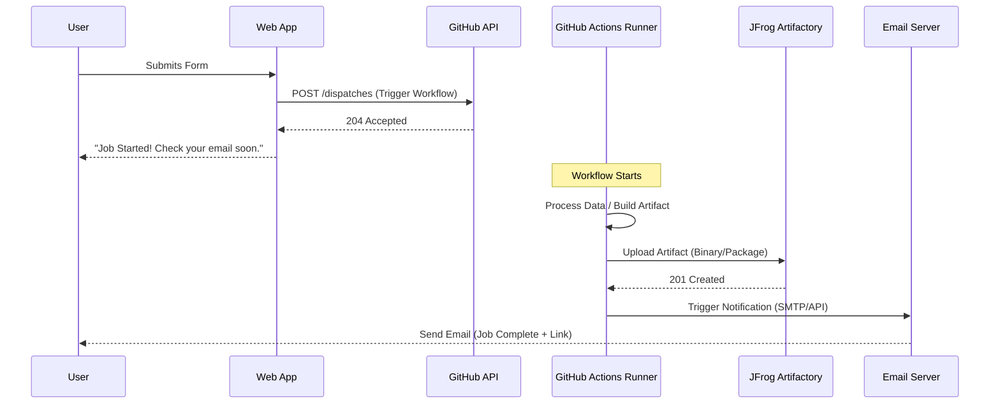
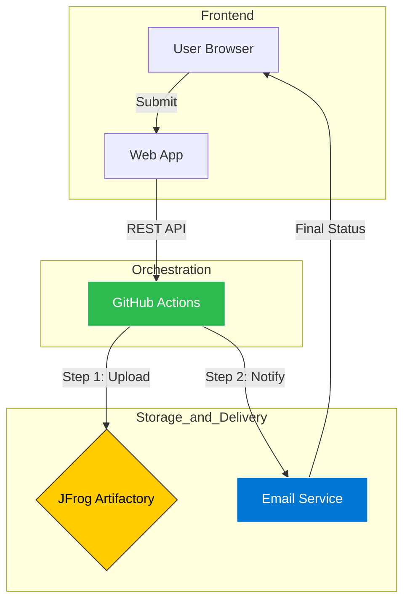
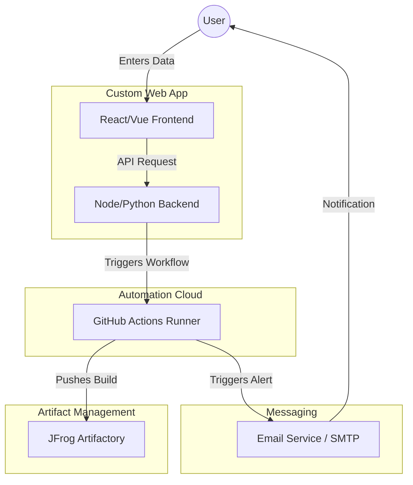
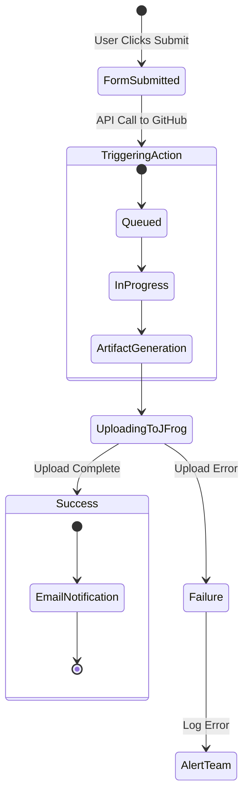

# Sequence flow diagram

```mermaid

sequenceDiagram
    participant U as User
    participant App as Web App
    participant GH as GitHub API
    participant GHA as GitHub Actions Runner
    participant JF as JFrog Artifactory
    participant Mail as Email Server

    U->>App: Submits Form
    App->>GH: POST /dispatches (Trigger Workflow)
    GH-->>App: 204 Accepted
    App-->>U: "Job Started! Check your email soon."

    Note over GHA: Workflow Starts
    GHA->>GHA: Process Data / Build Artifact
    GHA->>JF: Upload Artifact (Binary/Package)
    JF-->>GHA: 201 Created
    
    GHA->>Mail: Trigger Notification (SMTP/API)
    Mail-->>U: Send Email (Job Complete + Link)
```

# Grap view

```mermaid
graph TD
    subgraph Frontend
        A[User Browser] -->|Submit| B[Web App]
    end

    subgraph Orchestration
        B -->|REST API| C[GitHub Actions]
    end

    subgraph Storage_and_Delivery
        C -->|Step 1: Upload| D{JFrog Artifactory}
        C -->|Step 2: Notify| E[Email Service]
        E -->|Final Status| A
    end

    %% Styling
    style D fill:#ffcc00,stroke:#333,color:#000
    style E fill:#0078d4,stroke:#fff,color:#fff
    style C fill:#2dba4e,stroke:#fff,color:#fff
```

```mermaid

graph TB
    User((User))
    
    subgraph Your_Web_Stack [Custom Web App]
        UI[React/Vue Frontend]
        API[Node/Python Backend]
    end

    subgraph External_Services [Automation Cloud]
        GHA[GitHub Actions Runner]
    end

    subgraph Storage_Layer [Artifact Management]
        JF[JFrog Artifactory]
    end

    subgraph Communication [Messaging]
        SES[Email Service / SMTP]
    end

    User -->|Enters Data| UI
    UI -->|API Request| API
    API -->|Triggers Workflow| GHA
    GHA -->|Pushes Build| JF
    GHA -->|Triggers Alert| SES
    SES -->|Notification| User
```

# State diagram

```mermaid

stateDiagram-v2
    [*] --> FormSubmitted: User Clicks Submit
    FormSubmitted --> TriggeringAction: API Call to GitHub
    
    state TriggeringAction {
        [*] --> Queued
        Queued --> InProgress
        InProgress --> ArtifactGeneration
    }

    ArtifactGeneration --> UploadingToJFrog
    UploadingToJFrog --> Success: Upload Complete
    UploadingToJFrog --> Failure: Upload Error

    state Success {
        [*] --> EmailNotification
        EmailNotification --> [*]
    }
    
    Failure --> AlertTeam: Log Error

```

